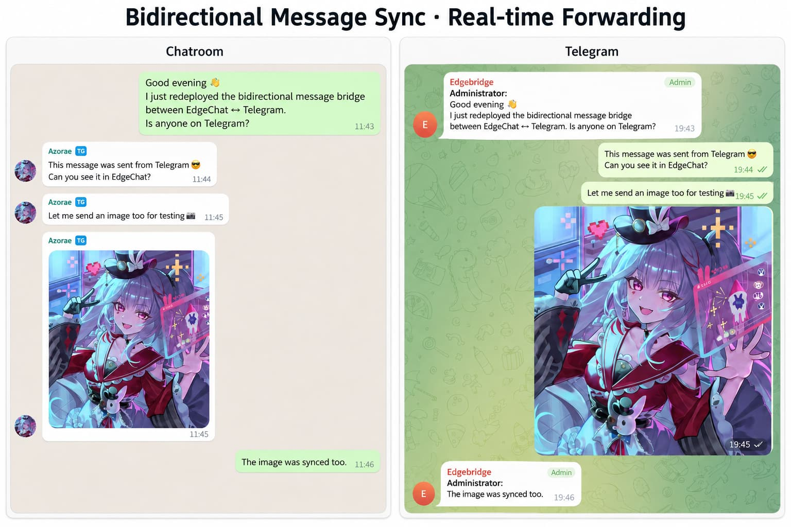

<div align="center">
  

  <h3>A modern team chat system built on the Cloudflare ecosystem</h3>
	  <p>Accounts · Public/Private Groups · Direct Messages · Real-time Messaging · Voice Messages · File Uploads · Admin Dashboard</p>

  <p>
    
    
    
    
    
  </p>
  <p>
    
    
    
    
    
    
  </p>

  <p>
    <a href="README.md">中文</a> ·
    <a href="README.en.md"><b>English</b></a> ·
    <a href="README.ja.md">日本語</a> ·
    <a href="https://edgechat-demo.wcjxxgaq.workers.dev">Online Demo</a> ·
    <a href="https://echat.azora.top/">Project Documentation</a> ·
    <a href="https://t.me/EdgeChatlounge">Telegram Community</a>
  </p>

  > ***This might be the best Cloudflare chat room for teams under 10 million users***
</div>

<br />

EdgeChat is a team chat system deployed on Cloudflare: accounts, public groups, private groups, direct messages, real-time messaging, voice messages, file uploads, and an admin dashboard — everything you need. The goal is straightforward: run a production-ready, in-site IM in the Cloudflare ecosystem with as little operational overhead as possible.

## Latest Update

> **Experimental WebMCP support**: EdgeChat is an early adopter of OpenAI's recently introduced experimental [Site tools (WebMCP)](https://learn.chatgpt.com/docs/webmcp) capability. Open and sign in to EdgeChat with ChatGPT Work or Codex in the ChatGPT desktop app's built-in browser, and the AI can discover and call the site's chat tools directly. Regular browsers, the existing interface, and the core Worker protocol remain unchanged.

| Tool | Capability | Status |
|---|---|---|
| `edgechat.login` | Sign in and establish the current browser session | ✅ |
| `edgechat.list_channels` | List channels visible to the user | ✅ |
| `edgechat.read_messages` | Read recent messages from a room | ✅ |
| `edgechat.send_message` | Send a message to a room | ✅ |
| `edgechat.open_dm` | Find or open a direct message | ✅ |

The login tool reuses the existing authentication flow and browser safety confirmation. Its result never includes the password or session token.

## Table of Contents

- [Interface Preview](#interface-preview)
- [Online Demo](#online-demo)
- [Featured Feature: Telegram Two-Way Message Bridge](#featured-feature-telegram-two-way-message-bridge)
- [Why EdgeChat](#why-edgechat)
- [Features](#features)
- [Tech Stack](#tech-stack)
- *[Telegram Community](#telegram-community)*
- [Deployment](#deployment)
- [Quick Start](#quick-start)
- [Project Structure](#project-structure)
- [Contributing](#contributing)
- [Star History](#star-history)
- [License](#license)
- [Disclaimer](#disclaimer)

## Interface Preview

<table>
  <tr>
    <td width="50%" align="center"><strong>Chat Interface</strong></td>
    <td width="50%" align="center"><strong>Admin Dashboard</strong></td>
  </tr>
  <tr>
    <td width="50%"></td>
    <td width="50%"></td>
  </tr>
</table>

## Online Demo

**[edgechat-demo.wcjxxgaq.workers.dev](https://edgechat-demo.wcjxxgaq.workers.dev)**

The demo site reuses the production project's Vue pages, routing, state management, and real-time messaging logic, but all APIs, WebSocket, file uploads, and Telegram round trips are simulated in browser memory. Reload the page or click **“Reset demo data”** in the top-right corner to restore the initial state. It never contacts the production Worker, nor does it write to D1, KV, or R2.

## Featured Feature: Telegram Two-Way Message Bridge

Admins can bind any group in EdgeChat to a Telegram group. Once bound, messages on both sides are **forwarded in real time, in both directions** through the Telegram Bot — messages sent by EdgeChat members appear in the Telegram group, and messages from the Telegram group appear in EdgeChat. Members on both sides chat as if they were in the same group, with no need to switch apps or create duplicate groups.

<div align="center">
  
  <br />
  <sub>Seamless real-time forwarding, two-way sync</sub>
</div>

## Why EdgeChat

| | EdgeChat | Self-hosted Rocket.Chat / Mattermost | Commercial SaaS IM |
|---|---|---|---|
| Deployment cost | Runs within Cloudflare's free tier | Requires an always-on server / container | Per-seat subscription fees |
| Ops burden | No server management, serverless | You maintain the database and cache yourself | No ops, but no control |
| Data ownership | Fully in your own Cloudflare account | Fully self-hosted | Data lives with a third party |
| Getting started | One-click auto-deploy via GitHub Actions | Manual / Docker Compose | Just sign up |

> This table is only a rough reference for choosing a solution. Whether it actually fits depends on your team size and needs — feel free to discuss and correct it in the Issues.

## Features

**💬 Messaging & Conversations**
- Public groups, private groups, and direct message conversations
- [Two-way Telegram group bridge](#featured-feature-telegram-two-way-message-bridge) — one Bot connects members on both sides
- Real-time messaging, paginated history, Telegram-style voice messages, and file messages
- The web client supports Telegram-style replies, quoted-message navigation, and reply-aware direct-attention alerts
- Web and Android recording, waveform seeking, playback speed controls, and two-way Telegram voice/audio sync
- File uploads and avatar management
- Scheduled hard deletion of expired messages

**🔐 Privacy & Security**
- Newly written messages and newly uploaded attachments are encrypted server-side with AES-256-GCM; historical data is not bulk-backfilled
- The admin dashboard offers no entry point for reading group or direct message contents
- Users are created by admins; self-registration is not available

**🛠 Admin Dashboard**
- Top-level navigation for dashboard, user management, registration invites, and site settings
- Permanently ban users or apply temporary bans in days, hours, or minutes; expired bans lift automatically without scheduled jobs
- Compares the current deployment directly against the source repository from the browser to check for updates

**🎨 Experience**
- Modern Liquid Glass-style interface
- Mobile-adapted, with basic accessibility support

## Tech Stack

<p>
  
  
  <br />
  
  
  
  
  <br />
  
</p>

## Telegram Community

Join our [Telegram community](https://t.me/EdgeChatlounge) to discuss with other users and developers, share feedback, and stay up to date with the project.

## Deployment

### GitHub Actions Auto Deployment (Recommended)

GitHub Actions deployment is recommended first — it suits long-term maintenance and production updates. The repository ships `.github/workflows/deploy-worker.yml`: pushing to `master` or `main`, or manually triggering `workflow_dispatch`, runs the automatic deployment.

- Quick start: <https://echat.azora.top/guide/getting-started.html>
- Detailed guide: <https://echat.azora.top/guide/actions-deploy.html>

### Android Clients

The primary Android release is now the `capacitor/` client. Its APK bundles the Vue Web UI, while a small Kotlin bridge handles system file selection, notifications, microphone permission, notification room opening, and external links. It uses the application ID `com.aozorae.edgechat.web`; users enter their own EdgeChat HTTPS origin on first sign-in, so the package is not tied to one deployment.

- Installation: download `edgechat-*.apk` from GitHub Releases and verify `SHA256SUMS.txt`
- First use: enter the self-hosted EdgeChat HTTPS origin, username, and password on the sign-in screen
- Local build: install JDK 21 and Android SDK 36, then run `npm run build:capacitor`
- Debug APK: `capacitor/android/app/build/outputs/apk/debug/app-debug.apk`
- CI: `.github/workflows/capacitor-android-ci.yml` uploads `edgechat-capacitor-debug`
- Release: push an `android-v*` tag or run `Android Release`; the workflow uses the four `ANDROID_KEYSTORE_*` Secrets to build signed APK/AAB artifacts
- Server switching: sign out and edit the URL; changing instances clears the previous instance token
- Limitation: this client currently has no Room offline database, WorkManager outbox, or FCM, so instant background notifications are not guaranteed when the app stops receiving messages

The native Kotlin + Jetpack Compose client in `android/` is temporarily deprecated and is no longer the default release. Its source, API v1 contract, and separate CI remain available for historical verification and future evaluation; use the Capacitor build for new installations and routine updates.

Full guide: <https://echat.azora.top/en/guide/android.html>

<details>
<summary><strong>🔐 Privacy & Server-Side Encryption (click to expand)</strong></summary>

<br />

GitHub Actions manages the server-side encryption Worker Secrets. On the first deployment, if the target Worker has no encryption Secret, the workflow automatically generates a random 32-byte AES key, injects it as an independent versioned Secret, and records the current active key ID. Subsequent normal deployments only check that these Secrets exist — they never regenerate, overwrite, or rotate them. An existing production `EDGECHAT_ENCRYPTION_KEYRING` JSON keyring is preserved as-is and remains compatible.

After deployment, newly written message bodies and newly uploaded attachments are encrypted automatically. Historical D1 messages and R2 attachments stay untouched, and reads remain compatible with both legacy plaintext and new ciphertext. The project never loops through all historical data via Cron, scheduled tasks, or deployment scripts to encrypt it.

To provide a key manually, create a GitHub Repository Secret named `EDGECHAT_ENCRYPTION_KEYRING` in the following format:

```json
{"activeKeyId":"v1","keys":{"v1":"BASE64_ENCODED_32_BYTE_KEY"}}
```

The first deployment uses this value directly. To rotate an existing Worker automatically and incrementally, manually run `Deploy Worker` and tick `rotate_encryption_key`: the workflow only adds one versioned key Secret and switches the active key ID to the new version, while every old Secret and the legacy JSON keyring stay unchanged. New messages use the new active key, and old ciphertext keeps being decrypted with the key ID in its own envelope.

`apply_encryption_keyring` is a backup manual override. When using it, the Repository Secret must contain the complete JSON keyring: `keys` must keep every old key ID still referenced by historical ciphertext, then add the new key and update `activeKeyId`. Removing an old key makes the corresponding historical ciphertext permanently unreadable. `apply_encryption_keyring` and `rotate_encryption_key` cannot be enabled in the same run.

This is server-side encryption at rest, not end-to-end encryption. The Worker decrypts content only after session permission checks, so the Cloudflare Worker runtime and the deployer who holds the key remain inside the trust boundary. As a complementary privacy change, the admin message search and full-conversation viewing pages and their APIs have been removed; admins can still see aggregate statistics such as message counts.

</details>

### Manual Deployment / Docker

<details>
<summary>Click to expand manual deployment and Docker notes</summary>

<br />

If you prefer to deploy manually, see the documentation site for the full steps, resource preparation, and notes:

- Manual deployment guide: <https://echat.azora.top/guide/getting-started.html>
- Documentation home: <https://echat.azora.top/>
- Docker local deployment: [DOCKER.md](DOCKER.md)

</details>

## Quick Start

```bash
# Install dependencies
npm install

# Frontend development
npm run dev:frontend

# Frontend-only demo (separate port and build directory)
npm run dev:demo

# Local build
npm run build

# Local manual deployment
npm run deploy
```

<details>
<summary>More scripts (demo build / deploy, CI environment variables)</summary>

<br />

```bash
# Build the standalone demo
npm run build:demo

# Deploy the standalone demo Worker
npm run deploy:demo
```

The demo uses `wrangler.demo.toml` and `.github/workflows/deploy-demo.yml`, with the Worker named `edgechat-demo`. Its GitHub Actions workflow is manual-trigger only and reads `DEMO_CLOUDFLARE_ACCOUNT_ID` and `DEMO_CLOUDFLARE_API_TOKEN`; it does not touch the existing production deployment workflow.

In non-interactive environments, set `CLOUDFLARE_API_TOKEN` before deploying.

The admin update check records the current GitHub repository, branch, and commit at build time. For accurate results, manual deployments should be built inside the Git repository from a clean commit that has already been pushed; the source repository must stay public so the browser can call the GitHub Compare API directly. The whole process creates no scheduled tasks.

PowerShell example:

```powershell
$env:CLOUDFLARE_API_TOKEN = "your-token"
npm run deploy
```

</details>

## Project Structure

<details>
<summary>Click to expand the directory tree</summary>

```text
edgechat/
├─ assets/
│  └─ previews/
│     ├─ chat-home.png
│     └─ admin-dashboard.png
├─ frontend/
│  ├─ src/
│  │  ├─ api.js
│  │  ├─ router.js
│  │  ├─ store.js
│  │  ├─ ws.js
│  │  ├─ runtime.js
│  │  ├─ demo/
│  │  ├─ styles.css
│  │  ├─ components/ui/
│  │  └─ pages/
│  ├─ vite.config.js
│  └─ vite.demo.config.js
├─ worker/
│  ├─ schema.sql
│  ├─ migrations/
│  └─ src/
│     ├─ index.js
│     ├─ auth.js
│     ├─ db.js
│     ├─ middleware.js
│     ├─ utils.js
│     ├─ api/
│     └─ do/
├─ wrangler.toml
├─ wrangler.demo.toml
├─ package.json
├─ README.md
├─ README.en.md
├─ README.ja.md
└─ LICENSE
```

</details>

For more implementation details, see [TECHNICAL.md](TECHNICAL.md) and the documentation site: <https://echat.azora.top/>

## Contributing

Issues and pull requests are welcome — let's improve EdgeChat together.

Thanks to everyone who has helped the project:

[](https://github.com/aozorae/Edgechat/graphs/contributors)

## Star History

<a href="https://www.star-history.com/?type=date&repos=aozorae%2FEdgechat">
  <picture>
    <source media="(prefers-color-scheme: dark)" srcset="https://api.star-history.com/chart?repos=aozorae/Edgechat&type=date&theme=dark&legend=top-left&sealed_token=GpyqTbdwb3a2OHOT-WlCSoSzrumr3iwtcNluTpGbcU5CuyfP4eKf9TjtDuJ2uY4XK0P6knEB6OFCkbaAMsMCO3vnGPprGvB4f4rd7kmbUNe3fJ8LNaaGVH7JZLDT7SNNy3DC-sBxZwBmfL7gP9AFv1iKX1FgYnRZuOBGcKkbWFlBuoq2TXpYIfWmoUF9" />
    <source media="(prefers-color-scheme: light)" srcset="https://api.star-history.com/chart?repos=aozorae/Edgechat&type=date&legend=top-left&sealed_token=GpyqTbdwb3a2OHOT-WlCSoSzrumr3iwtcNluTpGbcU5CuyfP4eKf9TjtDuJ2uY4XK0P6knEB6OFCkbaAMsMCO3vnGPprGvB4f4rd7kmbUNe3fJ8LNaaGVH7JZLDT7SNNy3DC-sBxZwBmfL7gP9AFv1iKX1FgYnRZuOBGcKkbWFlBuoq2TXpYIfWmoUF9" />
    
  </picture>
</a>

Give us a star!

## License

This project is licensed under [`GNU GPL v3.0 or later`](LICENSE).

You may use, modify, and distribute this project. If you distribute a modified version, you must continue to provide the corresponding source code and keep it GPL-compatible.

## Acknowledgements

Thanks to <a href="https://linux.do" target="_blank">linux do</a> for helping promote this project.

## Disclaimer

EdgeChat is a self-hosted open-source project. The project maintainers provide the software only and do not operate, control, or manage any instances users deploy themselves.

Deployers and users of each instance are solely responsible for how it is deployed and used, and for all content and data produced within it.

Project maintainers assume no responsibility for the use or misuse of any independently deployed EdgeChat instance.
